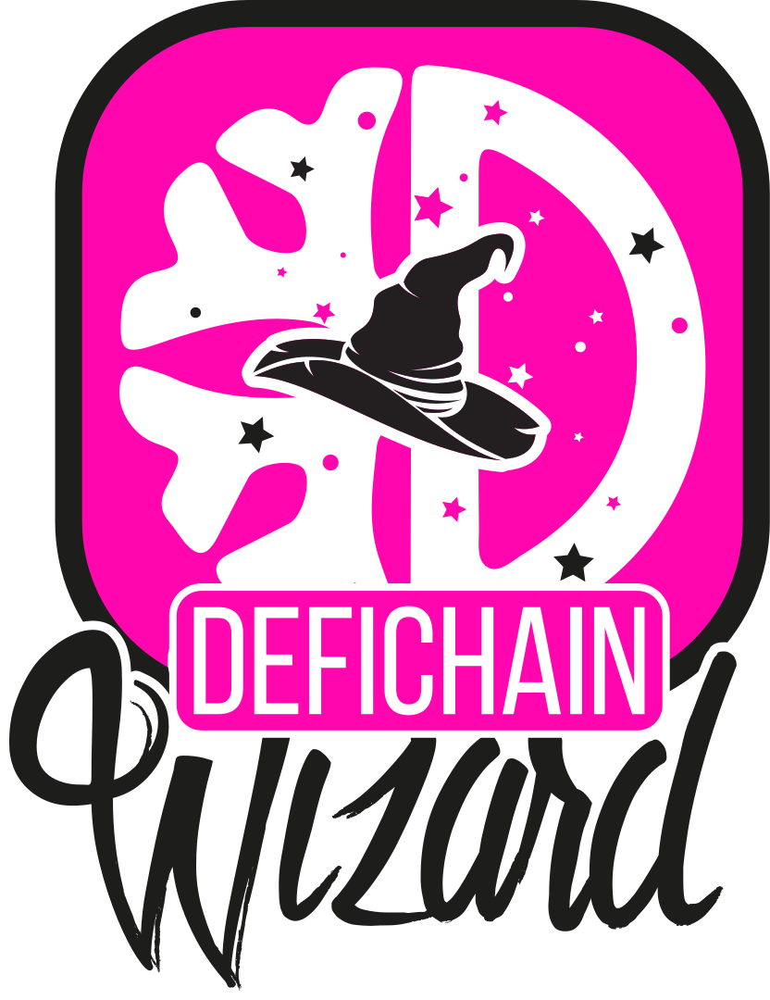

# DeFiChain Wizard - Backend

<p align="center"></p>

<br/>
<p align="center">
  <a href="https://twitter.com/DefichainWizard" target="_blank"></a>
  <a href="https://hub.docker.com/r/defichainwizard/wizard" target="_blank"></a>
</p>
<p align="center">
  <a href="https://t.me/defichain_wizard_support" target="_blank"></a>
  <a href="https://discord.com/channels/983701238057173062/988545150508736602" target="_blank"></a>
</p>
<p align="center">
  <a href="https://defichain-wizard.com" target="_blank"></a>
</p>

## Welcome to the DeFiChain Wizard!

The DeFiChain-Wizard is an App that allows you to automate vaults and other tools on the DeFiChain Blockchain.

Once it’s fully set up with the additional server, it’ll allow you to:

* Avoid vault liquidation by setting a minimum vault ratio
* Maximize returns by setting a maximum vault ratio
* Invest loans in liquidity pools of your choice
* Automatically reinvest DFI to compound rewards for more gain
* Keep you updated via Telegram notifications
* Manage settings directly from the app

> :star2: During the entire process, you’re holding your own private keys. For further security, the code has been reviewed by a 3rd party.

## WARNING!

> :warning: **Use this bot on your own risk**: We are trying to get the best out of your vault. But there might always be a bug!

## How it works

The DeFiChain-Wizard comes in two parts:

* An app that communicates (encrypted) with the DeFiChain blockchain
* And a “bot” which is running on your own server and retrieves the configuration sent by the app from the DeFiChain blockchain.

> :star2: This communication channel is on a top-notch security level because the settings cannot be changed by a third party. Security is our highest priority. Your backend does not have to have any open port! It only reads and sends via the DeFiChain blockchain.

### Overview

This image roughly illustrates how the communication works:

<p align="center">
<br>
  
</p>

## Our Mission

Our mission is to help drive DeFiChain adoption as the best blockchain for decentralized loans through excellent user experience and usability.

The intention of the DeFiChain-Wizard is to enrich the tool landscape of the DeFiChain with new features that will help even average users.

For that, it has been engineered with a modular architecture to enhance its security, stability, platform independence, scalability, and flexibility. 

Think of it as a platform, on which the community can build upon all kinds of automation. It is easily portable across different platforms, and the code is completely open-source.

## Getting started

If you just want to use the DeFiChain Wizard, just follow the step-by-step tutorial, which can be found on the [DeFiChain Wizard Website](https://defichain-wizard.com).

If you really want to dig into the development, just keep on reading.

### Check out this repository

```
git clone https://github.com/DeFiChain-Wizard/defichain-wizard-backend.git
```

### Install Dependencies

One cloned, change into the `defichain-wizard-backend` directory and run:

```
npm install
```

### Start bot

To start the bot directly from source, simply run:

```
npm start
```

## Build Docker Image

To build the Docker image you can use `docker-compose`, simply run:

```
docker-compose build
```

## Run Docker Image

To run the Docker image you can use `docker-compose`, simply run:

`docker-compose up` to run it interactively 

`docker-compose up -d` to run it detached 

## Basic configuration

In general the bot will grab the latest configuration from the blockchain. But for the initial config, you will have to setup your own config.

For this we use environment variables, please set at least the following variables:

- `WIZ_TELEGRAM_TOKEN`: Telegram Chat TOken 
- `WIZ_TELEGRAM_CHATID`: The Chat ID to send Telegram Messages to.
- `WIZ_BOT_ADDRESS`: The wallet address, the Wizard should use.
- `WIZ_SEED_PHRASE`: SEED Phrase (space separated): Take care to store this as a secure value!

### Optional environment variables

- `WIZ_BOT_NAME`: The name of your bot, that will be display in the logs and in your telegram message
- `WIZ_DFICHAIN_URL`: If you want to connect to another URL (default: https://ocean.defichain.com)
- `WIZ_DFICHAIN_VERSION`: The version of the defichain API to use (default: v0)
- `WIZ_DFICHAIN_TIMEOUT`: The timeout in ms that you are willing to accept for API calls (default: 60000)
- `WIZ_DFICHAIN_NETWORK`: The network to be used by your bot (default: mainnet)
- `NODE_ENV`: `production`: If you want less output on the console.

## Developers

### Setting up IDE

This project comes with some vscode settings that should be used, when developing. (stored in `.vscode` directory)

> :star2: If you want to join our developer team, feel free to contact us. Or you can just fork this repository and create a PR with new features or bugfixes.

Have fun with the DeFiChain Wizard! 🧙